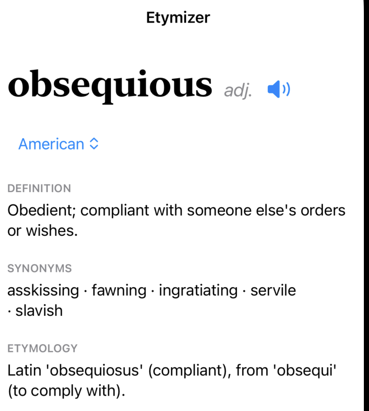
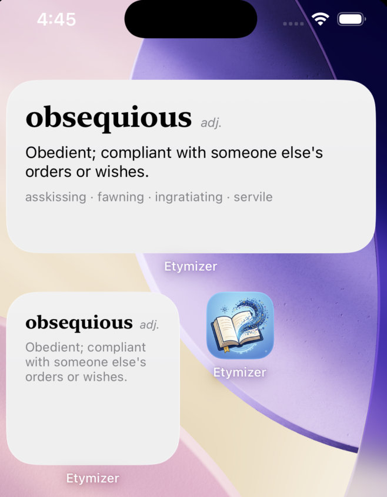
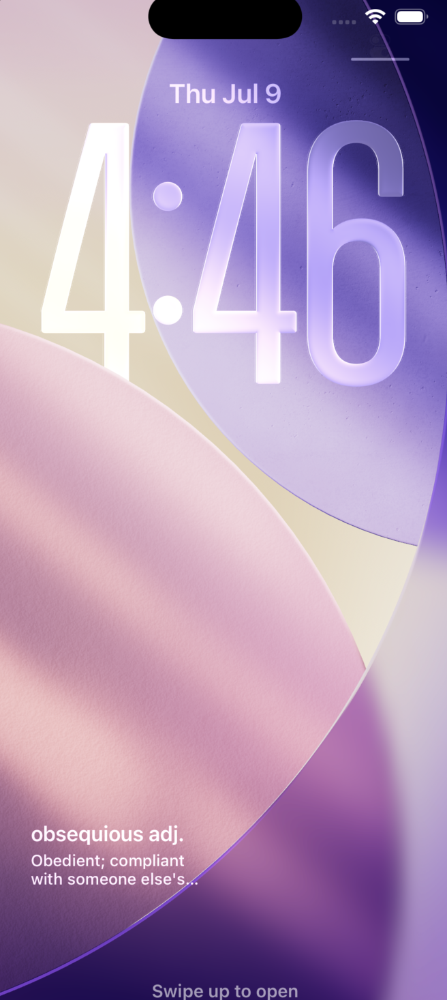

# Etymizer - Word of the Day — iOS Widget

**Etymizer** is an iOS home-screen widget that shows you one word a day — its
definition, synonyms, and a bit of etymology. It rotates automatically at
midnight, works offline from a bundled word list, and enriches definitions from
a free dictionary API when you're online. Tap the speaker icon to hear the word 
pronounced in five accents (US, UK, Australian, Irish, South African).No account, no 
menu, no notifications, no upsell. It just puts a good word on your home screen 
every morning.

Small and medium home-screen widgets plus three lock-screen styles. Built with
WidgetKit and SwiftUI.

---

## Screenshots

---

## What you're building

- **App target** — picks the day's word, fetches definition/synonyms from a free API,
  writes the result to a shared container, shows a full detail screen.
- **Widget target** — reads the shared container, renders small + medium layouts,
  rotates the word at midnight.
- **Shared files** — model + data store used by both.

Etymology comes from the bundled `WordBank.json` (free APIs don't reliably provide it).
Definition and synonyms come live from the Free Dictionary API, falling back to bundled
data when offline.

---

## Setup (do this on your Mac, in order)

### 1. Create the project
1. Open Xcode → **File ▸ New ▸ Project ▸ iOS App**.
2. Name it `WordOfDay`. Interface: **SwiftUI**. Language: **Swift**.
3. Delete the auto-generated `ContentView.swift` and the default `App` file.

### 2. Add the Widget target
1. **File ▸ New ▸ Target ▸ Widget Extension**. Name it `WordWidget`.
2. **Uncheck** "Include Live Activity" and "Include Configuration Intent".
3. When prompted to activate the scheme, click **Activate**.
4. Delete the boilerplate Swift file Xcode generated inside the widget folder.

### 3. Add the source files
Drag these in from this folder, assigning targets as noted:

| File                         | App target | Widget target |
|------------------------------|:----------:|:-------------:|
| `Shared/WordStore.swift`     |     ✅      |      ✅       |
| `Shared/WordEnricher.swift`  |     ✅      |      ✅       |
| `App/WordOfDayApp.swift`     |     ✅      |      ❌       |
| `Widget/WordWidget.swift`    |     ❌      |      ✅       |
| `Widget/WordWidgetBundle.swift` |  ❌      |      ✅       |
| `WordBank.json`              |     ✅      |      ✅       |

> When dragging, check the right boxes under "Add to targets". The two Shared files
> and the JSON must belong to **both** targets.

### 4. Create the App Group (the app↔widget bridge)
1. Select the **app target ▸ Signing & Capabilities ▸ + Capability ▸ App Groups**.
2. Add a group, e.g. `group.com.yourname.wordofday`.
3. Repeat for the **widget target** — use the *exact same* group string.
4. Open `Shared/WordStore.swift` and set `appGroupID` to match that string.

### 5. Allow network access
The app makes one HTTPS call. App Transport Security allows HTTPS by default — no
plist change needed. (If you ever see a network error, confirm the URL is `https://`.)

### 6. Run
1. Select the **WordOfDay app** scheme → run on your iPhone (or simulator).
   Open it once so it fetches and caches today's word.
2. Long-press the home screen ▸ **+** ▸ search "Word of the Day" ▸ add small or medium.

---

## Sideload notes (no paid Apple account)
- Free Apple ID works: the app + widget run on your own device but the provisioning
  profile **expires every 7 days** — re-run from Xcode to refresh.
- A $99/yr Apple Developer account removes the 7-day expiry.

## Customizing the word list
Edit `WordBank.json`. Each entry needs `word`, `definition`, `synonyms`, `etymology`.
Add as many as you like — the app rotates through them by calendar day — add more 
entries to stretch the cycle before repeats. The live API will override `definition`/
`synonyms` when online; your `etymology` is always preserved.

## How the daily rotation works
`WordStore.bundledWord(for:)` indexes the list by the day-of-era number modulo list
length — deterministic, so the same word shows all day and advances at midnight when
the widget timeline refreshes.
